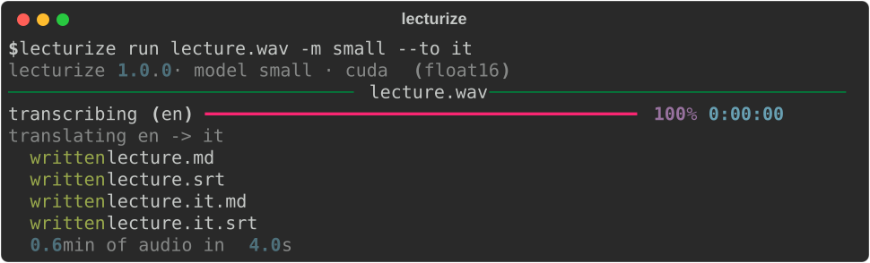

# lecturize

[](https://github.com/davidcohenDC/lecturize/actions/workflows/build.yml)
[](https://pypi.org/project/lecturize/)
[](LICENSE)

I record two hour lectures and I want them back as notes, not as audio.
`lecturize` transcribes them on my machine with
[faster-whisper](https://github.com/SYSTRAN/faster-whisper), continues from the
last sentence if the run is interrupted, writes markdown chapters, SRT and Word
files, and can translate them into fifty languages with local models. No
PyTorch, no server, no API key.

```sh
pipx install lecturize
lecturize run lecture.mp4 --to it
```

That writes `lecture.md`, `lecture.srt`, `lecture.it.md` and `lecture.it.srt`
next to the recording.



Three things I could not find together anywhere else:

- **Resumable by design.** Every utterance is saved as soon as it is produced.
  Kill the process, reboot, run the same command: it continues from the last
  one and ends with the same output a clean run would give. `lecturize jobs`
  shows what is pending;
- **Notes, not subtitles.** Markdown with a chapter every few minutes cut at
  the pauses, paragraphs of whole sentences, plus SRT and docx from the same
  timeline. No language model involved;
- **Small and local.** One `pipx install`, about 300 MB, no PyTorch.
  Translation with the OPUS-MT models packaged by
  [Argos Translate](https://github.com/argosopentech/argos-translate), run on
  CTranslate2: 90 MB per language pair, about a minute for a two hour lecture.

## Install

Python 3.10 or newer. [pipx](https://pipx.pypa.io/) keeps it out of your other
environments:

```sh
pipx install lecturize            # CPU
pipx install "lecturize[cuda]"    # NVIDIA GPU: adds the CUDA libraries, about 2 GB more
```

Models are downloaded on first use (`lecturize paths` shows where): `small` is
460 MB, `large-v3` about 3 GB, a translation package 90 MB. Every thirty days
the list of translation packages is refreshed from GitHub. Nothing else leaves
the computer. ffmpeg is not needed: decoding goes through PyAV.

## Use

```sh
lecturize run talk.mp3                       # small model, language checked, md + srt
lecturize run talk.mp3 -l it                 # say the language when you know it
lecturize run talk.mp3 -m large-v3           # a bigger model
lecturize run talk.mp3 --to it -f md,docx    # Italian notes as markdown and Word
lecturize run talk.mp3 --to en               # English only, translated by Whisper itself
lecturize run *.mp4 -o notes/                # many files, outputs in one folder
lecturize run talk.mp3 --fresh               # ignore the checkpoint, start over
lecturize jobs                               # interrupted runs; --clear forgets them
lecturize languages                          # translation targets available
```

When you do not pass `-l`, the first minute is decoded in the most likely
languages and the one the model finds easiest to explain wins; the result is
printed with the first words, so you can see at once if it went wrong. Whisper's
own detector is confidently wrong on accented speakers (it called an English
lecture Slovenian at 95%), which is why the check exists and why `-l` is still
the safest option when you know the language.

Options: `-m/--model` (tiny, base, small, medium, large-v2, large-v3,
large-v3-turbo, distil-large-v3, a folder or a Hugging Face id),
`-l/--language`, `--to`, `-f/--format` (txt, md, srt, docx), `-o/--out`,
`--device auto|cpu|cuda`, `--compute-type`, `--no-vad`, `--fresh`,
`--overwrite`.

Measured on a laptop with an RTX 3080 Ti: `small` runs at about seven times
real time on the CPU (int8) and twenty times on the GPU (float16); `medium` at
three and nineteen. A two hour lecture is about 17 minutes on the CPU with
`small`, 6 minutes on the GPU. Memory stays around 1 GB whatever the length,
because the audio is decoded in ten minute blocks.

From Python:

```python
from pathlib import Path
from lecturize import device
from lecturize.engine import Engine
from lecturize.pipeline import Job, run

dev = device.pick("auto")
run(Job(Path("talk.mp3"), model="small", to="it"), Engine("small", dev))
```

## What it does not do

- no speaker diarization, no word level timestamps in the output, no VTT: for
  those use [whisperX](https://github.com/m-bain/whisperX) (PyTorch, NVIDIA);
- no GUI, no live microphone, no Apple Silicon or AMD GPU: use
  [Buzz](https://github.com/chidiwilliams/buzz) or
  [Vibe](https://github.com/thewh1teagle/vibe) (whisper.cpp, Metal and Vulkan).
  On a Mac lecturize runs on the CPU;
- no server: [Speaches](https://github.com/speaches-ai/speaches) gives you an
  OpenAI compatible API in Docker;
- if you want a plain drop-in for the `whisper` command without PyTorch,
  [whisper-ctranslate2](https://github.com/Softcatala/whisper-ctranslate2) is
  that. lecturize is that plus the checkpoint, the notes and the translation.

## Known problems

- changing `-m`, `-l` or `--to en` starts a new job: the checkpoint is keyed by
  those settings;
- with `--to en` only the English files are written, because Whisper translates
  while it transcribes;
- SRT cues follow Whisper's segments and can run long (up to 30 s on fast
  speakers); they are not re-split for subtitle editors;
- translation quality is OPUS-MT quality: good enough for notes, not for
  publishing;
- the language check costs up to thirty seconds on a slow CPU. Pass `-l` to
  skip it.

## Development

```sh
git clone https://github.com/davidcohenDC/lecturize.git && cd lecturize
python -m venv .venv && . .venv/bin/activate     # .venv\Scripts\activate on Windows
pip install -e ".[dev]"
ruff check src tests && mypy src && pytest        # pytest -m slow runs the real engine on tests/data
```

Issues and pull requests are welcome; conventional commit titles (`fix:`,
`feat:`) drive the version number. Keep the package free of PyTorch.

## Licenses

MIT. At run time it downloads Whisper models converted by SYSTRAN (MIT) and
translation packages from Argos Translate built on
[OPUS-MT](https://github.com/Helsinki-NLP/Opus-MT) models (CC-BY 4.0: keep the
attribution if you redistribute their output). The Silero VAD model inside
faster-whisper is MIT, PyAV bundles FFmpeg under the LGPL. The sample recording
in `tests/data` is synthetic speech from a text I wrote.

© 2026 David Cohen
